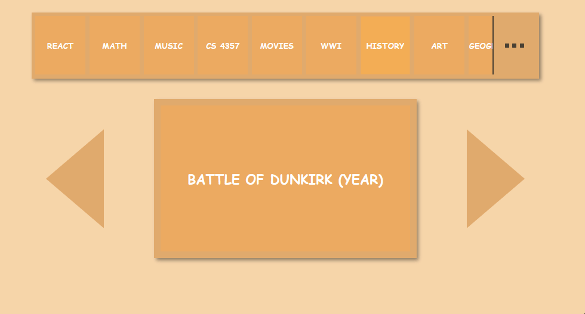
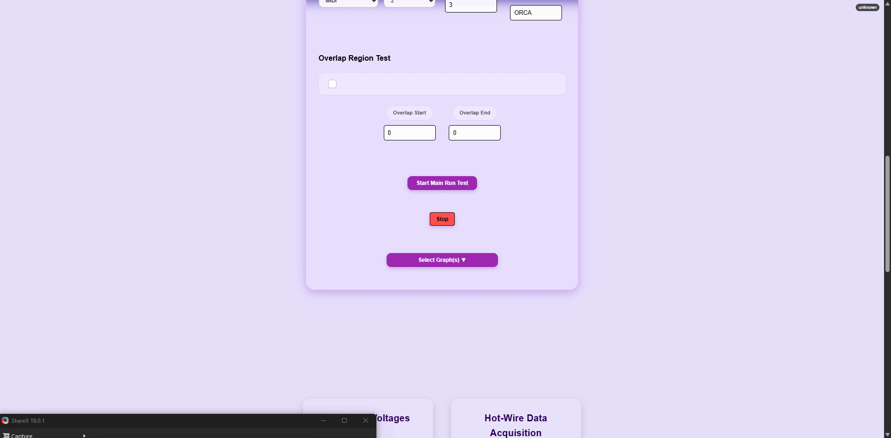
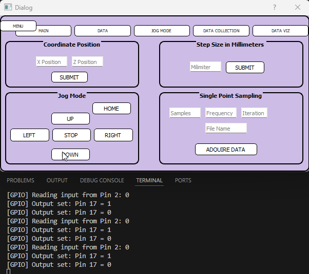

<h1>Ivan Luna <br/><a href="https://github.com/IALT1234">Backend / Full-Stack Software Engineer</a>

### I build backend and full-stack systems that connect data, hardware, and users.


<h2>Projects & Professional Experience:</h2>


<b><a href="https://github.com/IALT1234/SPEAR">SPEAR Flashcards App</a></b> <i> (React, Python, FastAPI, JWT)</i>
<table> <tr> <td valign="top" width="55%"> <ul> <li>Full-stack application with authentication and REST APIs.</li> <li>User-scoped data with persistent study workflows.</li> </ul> </td> <td width="45%" align="center">  </td> </tr> </table> ```


<b><a href="https://github.com/IALT1234/Probe-Testing-Page/tree/main"> Web-Based Motor Control </a></b> <i> (JavaScript, Chart.js, Python, Flask, SQL)</i> 
<table> <tr> <td valign="top" width="55%"> <ul> <li>Hardware-integrated control and visualization platform.</li> <li>Real-time sensor data collection and monitoring.</li> </ul> </td> <td width="45%" align="center">  </td> </tr> </table> ```


<b><a href="https://github.com/IALT1234/HoetWire-PyQT"> (PyQT5, Python)*  
<table> <tr> <td valign="top" width="55%"> <ul> <li>Desktop application for running and visualizing laboratory experiments.</li>  </ul> </td> <td width="45%" align="center">  </td> </tr> </table> ```


---

### Other Software Projects

- **[MINER HAVEN Hotel Web App](https://github.com/UTEP-Agile-SP25/spring-2025-team-repository-team-12)** *(React, Firebase)*  
  Full-stack web application with authentication and user workflows.

- **[Chess Game Development](https://github.com/IALT1234/Chess-Game-Development)** *(Java, JUnit)*  
  Object-oriented chess engine with accurate move logic and unit-tested rules.

---

    
### Data & Machine Learning

- **[Stock Market Prediction](https://github.com/IALT1234/Stock-Prediction)** *(Python, Jupyter Notebook)*  
  Time-series modeling of Netflix stock prices (2018–2020).

- **[House Pricing Prediction](https://github.com/IALT1234/House-Pricing-Prediction/tree/main)** *(Python, Jupyter Notebook)*  
  Machine learning models for housing price analysis and prediction.

---

## Interests
- Backend and platform software engineering  
- Data-driven applications and APIs  
- Systems that interface with hardware or real-world processes  

---

## Connect with Me

[](https://www.linkedin.com/in/ialuna/)

